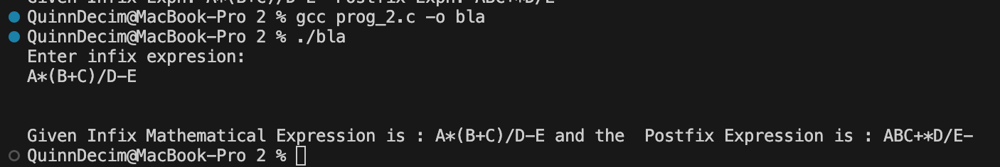

 Data Structures
The program uses a character array as a stack to store operators. It uses a global integer top to track the current position in the stack. Two other arrays are used to store the input and output strings.

Functions
push(): Adds a character to the stack.

pop(): Removes and returns the top character from the stack.

priority(): Assigns a numeric value to operators to determine their importance (e.g., * is higher than +).

Main Method Organization
The main() method reads the user's input. It uses a loop to check each character. Operands are sent to the output, and operators are moved to the stack based on their priority. After the loop, it prints the final postfix string.

Sample Output;
