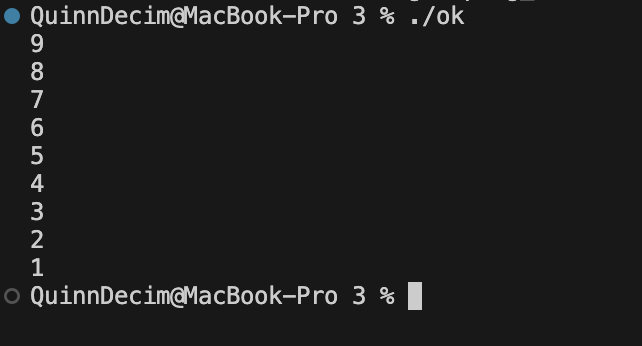

Data Structures
A struct is used to specify the data structure, which is a typical singly linked list node. It is composed of a pointer named next that leads to the next node in the sequence and an integer member called data for storing values. This structure is designated as a node using a typedef, enabling more straightforward declarations that do not require the struct keyword.

Function
Recursive in nature, the printList function is intended to print the list backwards. Before doing any print commands, it navigates to the end of the list. The function uses the system stack to "unwind," publishing the data from each node only after processing the succeeding nodes, by inserting the printf statement after the recursive call.

main()
The main() method handles the list's lifespan in three parts. First, a for loop is used to create memory for 10 nodes, each of which is assigned an integer value between 0 and 9. Second, it creates links between these nodes to build a continuous chain. Finally, it returns the head pointer to the beginning of the list and invokes printList to show the backward traversal.

Sample output:

