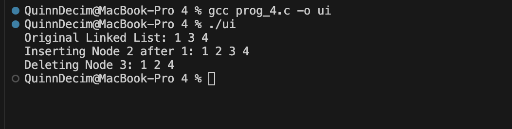

Data Structure 
The structure qwe defines the basic unit of the list. It consists of an integer variable ret for data storage. Two pointers, yui and iop, represent the next and previous memory addresses respectively.

Function
The code defines a doubly linked list using the qwe structure for bidirectional data storage. The asd function allocates nodes, while zxc inserts new nodes after a target value. The uio function removes nodes by bridging adjacent pointers and freeing memory, and lzx prints the list. The main function demonstrates these by manually building a list and executing the operations.

main
The main function initializes the list by manually linking three nodes. It then executes the lzx function to display the current state. Subsequently, it calls the insertion and deletion functions and prints the updated list after each modification.

Sample Output :

