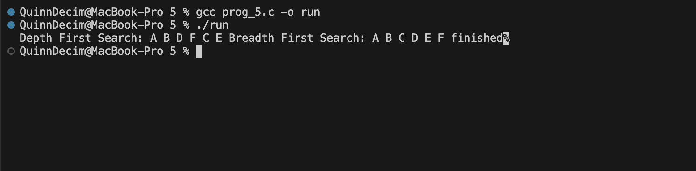

The code creates an undirected graph with a 10x10 adjacency matrix mat, where 1 indicates an edge, and a struct V that stores vertex names and visited status. The init function clears the matrix, conn assigns symmetrical 1s to link nodes, and clr resets the visited flags between runs. To traverse the matrix routes, dfs utilizes recursion, whereas bfs uses an array-based queue to investigate neighbors level by level. The main method arranges the program by initializing the matrix, allocating memory for vertices A through J, constructing five specific connections (A-B, A-C, B-D, C-E, and D-F), and performing both search strategies beginning with vertex A to display the traversal order.

The output is as follows:
