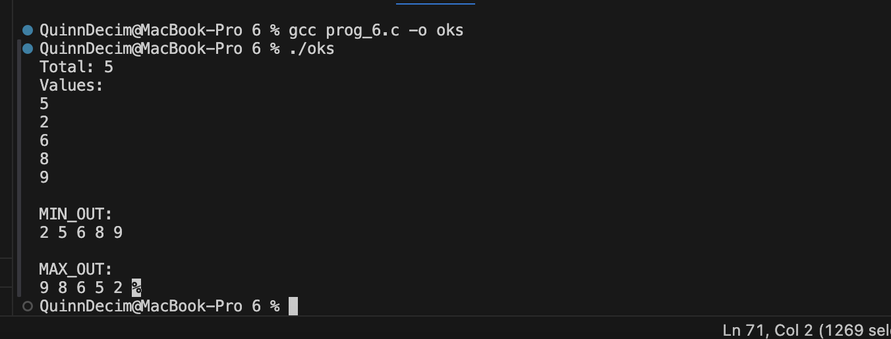

The code's core data structure is simple integer arrays, with the binary tree relationship maintained by index computations (2i+1 and 2i+2). The swap function trades fundamental values, but the min_h and max_h functions recursively move the least or greatest value to the parent location. The make_min and make_max procedures traverse through the non-leaf nodes, converting a regular array into a suitable heap. The main method is designed to collect a user-defined count and set of integers, store them in two identical arrays, convert each array to its appropriate heap type, and show the resulting sequences.

The output is as follows:
