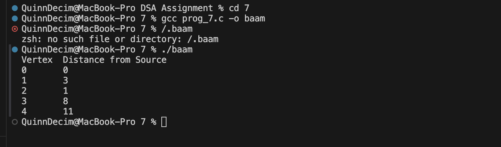

This C program implements Dijkstra's Algorithm by defining graph edges using a 2D adjacency matrix data_grid and tracking path costs with 1D arrays p (distances) and q (visited status). The find_low function finds the next closest unvisited vertices, run_proc executes the core relaxation logic to update shortest pathways, and show_out publishes the results, while the main method initializes the graph and starts the process at vertex 0. A sample run produces the following results: Vertex 0: 0, Vertex 1: 3, Vertex 2: 1, Vertex 3: 8, and Vertex 4: 11.

the output is 

