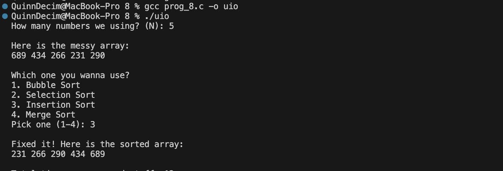

The program maintains data using a conventional integer array of a size specified by the user at runtime, with Merge Sort also employing temporary auxiliary subarrays during the recursive division and merging process. The functions bub (Bubble Sort), sel (Selection Sort), ins (Insertion Sort), and mst (Merge Sort) sort the array while incrementing the global counters com and swa, which track comparisons and swaps.The main method determines the array size, fills it with random integers, displays the unsorted list, and then uses a switch statement to perform the selected algorithm before publishing the final results. A sample output is: "How many numbers we are using? (N): 3". "Here's the disorganized array: 45 12 89", "Which one do you want to use? 1. Bubble Sort. 2. Selection Sort 3. Insertion Sort. 4. Merge Sort Pick One (1-4): 1", "It's fixed! The sorted array is as follows: 12 45 89", "Total times we compared stuff: 3", "Total times we switched stuff: 1".

the output is 
